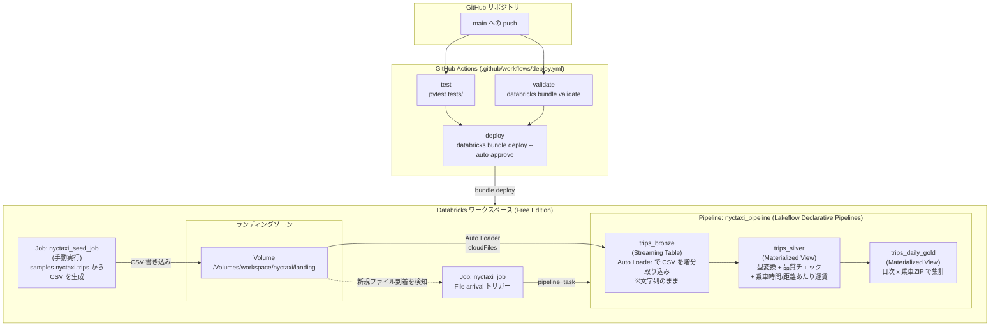

# databricks-dab-practice

Databricks Asset Bundles (DAB) の学習用プロジェクトです。
NYC タクシーデータのメダリオンパイプラインを DAB で管理します。

## このプロジェクトで検証している POC

「Databricks Asset Bundles でデータ基盤をコードとして管理し、
GitHub への push だけで検証環境にデプロイまで到達させる」ことを主眼に、
以下の要素を一通り実装・検証しています。

| # | 検証項目 | 実装箇所 |
| --- | --- | --- |
| 1 | DAB による Job / Pipeline / Volume / Schema 参照の宣言的管理（IaC） | `databricks.yml`, `resources/*.yml` |
| 2 | メダリオンアーキテクチャ（bronze → silver → gold）を Lakeflow Declarative Pipelines で構築 | `pipelines/nyctaxi_pipeline.py` |
| 3 | 実務で多いパターン（外部システムがストレージに CSV を置く）を Auto Loader で増分取り込み | `trips_bronze`, ランディング Volume |
| 4 | ファイル到着をトリガーにした自動実行（固定スケジュールではなくイベント駆動） | `nyctaxi_job` の File arrival トリガー |
| 5 | GitHub Actions による CI/CD（テスト → validate → deploy の自動化） | `.github/workflows/deploy.yml` |
| 6 | Databricks 実行環境に依存しない変換ロジックの単体テスト | `pipelines/transforms.py`, `tests/test_transforms.py` |
| 7 | 過去に踏んだ設定ミスを機械的に検知するテスト（再発防止のハーネス） | `tests/test_resource_conventions.py` |
| 8 | 構成変更・機能拡張時のドキュメント更新漏れを検知するハーネス + フィードフォワード | `CLAUDE.md`, `tests/test_readme_sync.py` |
| 9 | 組織のロール構成（データエンジニア/アナリスト/閲覧者）をコードで再現し権限を管理 | `resources/nyctaxi_permissions_job.yml`, `notebooks/grant_role_access.py` |
| 10 | グループ作成・entitlements 付与を手動 UI 操作ではなく CI から自動化（SCIM Groups API） | `resources/groups.json`, `scripts/ensure_groups.py` |
| 11 | IaC に無いグループの自動検知・削除、グループ経由でない直接権限の監査（ガバナンスのドリフト検知） | `scripts/audit_undeclared_groups.py`, `scripts/audit_user_entitlements.py` |

## 全体構成図



### データの流れ（実行時）

1. `nyctaxi_seed_job` を実行 → `samples.nyctaxi.trips` から一部を抜き出し CSV としてランディングゾーン（Volume）へ書き出す
2. Volume に新しい CSV が届いたことを **File arrival トリガー** が検知し、`nyctaxi_job` を自動起動
3. `nyctaxi_job` が `nyctaxi_pipeline` を起動
4. `trips_bronze`（Auto Loader）が未取り込みの CSV だけを増分で読み込む（文字列のまま）
5. `trips_silver` が型変換・品質チェックを行い、乗車時間や距離あたり運賃を付与
6. `trips_daily_gold` が日次 × 乗車 ZIP で集計

### デプロイの流れ（コード変更時）

1. `resources/*.yml` や `pipelines/*.py` を編集して `main` に push
2. GitHub Actions が `pytest`（ユニットテスト）と `databricks bundle validate` を実行
3. 両方が通れば `databricks bundle deploy --auto-approve` でワークスペースに反映

## 構成

```
.
├── databricks.yml                  # バンドル定義（バンドル名 / ターゲット）
├── resources/
│   ├── nyctaxi_landing.yml         # ランディング用 Volume 定義
│   ├── nyctaxi_pipeline.yml        # パイプライン定義（メダリオン構成）
│   ├── nyctaxi_job.yml             # Job 定義（パイプラインを起動）
│   ├── nyctaxi_seed_job.yml        # Job 定義（CSV をランディングゾーンへ投入）
│   ├── nyctaxi_permissions_job.yml # Job 定義（3ロールへの権限付与）
│   └── groups.json                 # ワークスペースグループと entitlements の一覧
├── scripts/
│   ├── scim_client.py               # SCIM API 共通ヘルパー（他の scripts/*.py から import）
│   ├── ensure_groups.py             # groups.json のグループ作成・entitlements 同期（CI から実行）
│   ├── audit_undeclared_groups.py  # IaC に無いグループを検知・削除（CI から実行）
│   └── audit_user_entitlements.py  # グループ経由でない直接 entitlements を検知（CI から実行、報告のみ）
├── notebooks/
│   ├── seed_nyctaxi_csv.py         # CSV シード投入用 Notebook
│   └── grant_role_access.py        # 3ロールへの GRANT を発行する Notebook
├── pipelines/
│   ├── nyctaxi_pipeline.py         # bronze(Auto Loader) / silver / gold を宣言する Python（dlt 依存）
│   └── transforms.py               # 変換ロジック本体（純粋関数、pytest でテスト可能）
├── tests/
│   ├── conftest.py                    # ローカル SparkSession フィクスチャ
│   ├── test_transforms.py             # transforms.py のユニットテスト
│   ├── test_resource_conventions.py   # resources/*.yml の命名規則チェック（再発防止）
│   └── test_readme_sync.py            # README.md の更新漏れチェック（再発防止）
├── requirements-test.txt           # テスト用依存関係（pyspark, pytest, PyYAML）
└── CLAUDE.md                       # 変更時に README も更新するというルールなどの開発ガイド
```

- Pipeline: `nyctaxi_pipeline` — Lakeflow Declarative Pipelines（旧 Delta Live Tables）
- Job: `nyctaxi_job` — `pipeline_task` で上記パイプラインを起動（ランディングゾーンへの CSV 到着を検知する File arrival トリガー）
- Job: `nyctaxi_seed_job` — ランディングゾーンへ CSV を投入する（手動実行用）
- Job: `nyctaxi_permissions_job` — データエンジニア/アナリスト/閲覧者の3ロールへ権限を付与する（手動実行用）
- Free Edition はサーバーレスコンピュートのみ利用できるため、クラスタ定義は含めていません

## データパイプライン（nyctaxi_pipeline）

実際の現場でよくある「外部システムがストレージに CSV を置き、それを増分で取り込む」
という構成を、Unity Catalog Volume と Auto Loader で再現しています。
入力データ自体は `samples.nyctaxi.trips`（Databricks に最初から用意されているサンプル）から
CSV として書き出したものです。

| レイヤ | テーブル | 内容 |
| --- | --- | --- |
| Bronze | `trips_bronze` | Auto Loader (`cloudFiles`) で landing volume の CSV を増分取り込み（すべて文字列） |
| Silver | `trips_silver` | 文字列カラムを型変換し、品質チェック（運賃・距離・時刻）で不正行を除外。乗車時間と距離あたり運賃を付与 |
| Gold | `trips_daily_gold` | 乗車日 × 乗車 ZIP ごとの件数・平均運賃・平均距離を集計 |

- 出力先は `workspace.nyctaxi` スキーマ（`resources/nyctaxi_pipeline.yml` の `catalog` / `schema`）
- ランディングゾーンは `resources/nyctaxi_landing.yml` で定義する Volume
  `/Volumes/workspace/nyctaxi/landing`。`catalog_name` / `schema_name` は
  パイプラインと同じく文字列で直接指定しています
  （`mode: development` を使うと、バンドル管理の `schemas` リソースの物理名が
  `dev_<user>_nyctaxi` のようにリネームされてしまうため、あえて schemas
  リソースにはせず、パイプラインが作成する `nyctaxi` スキーマをそのまま参照しています。
  詳しくは「開発時の注意点」を参照）
- 品質ルールは `@dlt.expect_all_or_drop` で定義。違反行は取り込まれず、パイプライン画面でドロップ件数を確認できます
- CSV は Auto Loader の既定動作どおり、いったんすべて文字列として Bronze に入り、
  Silver に渡す前に `cast_raw_trip_columns`（`pipelines/transforms.py`）で型変換します

### 実行方法

1. **CSV を投入する** — `nyctaxi_seed_job` を **Run**。`samples.nyctaxi.trips` から
   2,000 件を抜き出し、4 ファイルに分けてランディングゾーンへ CSV として書き出します。
2. **パイプラインを実行する** — `nyctaxi_pipeline`（または `nyctaxi_job`）を **Run**。
   Auto Loader がランディングゾーンの CSV を取り込み、bronze → silver → gold を更新します。

```bash
databricks bundle run nyctaxi_seed_job -t dev   # CSV をランディングゾーンへ投入
databricks bundle run nyctaxi_pipeline -t dev   # パイプラインを直接実行
databricks bundle run nyctaxi_job -t dev        # Job 経由で実行
```

`nyctaxi_seed_job` をもう一度 **Run** すると、ランディングゾーンに新しい CSV が
追加で書き込まれます。その状態で `nyctaxi_pipeline` を再実行すると、
Auto Loader が「前回取り込み済みのファイルはスキップし、新しいファイルだけを取り込む」
様子を確認できます（bronze テーブルの行数が差分だけ増える）。

### 自動実行（File arrival トリガー）

`nyctaxi_job` は `pipeline_task` でパイプライン ID を参照しており、
ID はバンドルのデプロイ時に `${resources.pipelines.nyctaxi_pipeline.id}` で自動解決されます。

手動で Run する代わりに、ランディングゾーン（`/Volumes/workspace/nyctaxi/landing/`）に
新しい CSV が届いたことを検知して自動的に起動する **File arrival トリガー** を設定しています。
`nyctaxi_seed_job` を実行して CSV を投入すると、`nyctaxi_job` → `nyctaxi_pipeline` が
自動的に起動し、手動で Run しなくても取り込みが行われます。

```yaml
trigger:
  file_arrival:
    url: /Volumes/workspace/nyctaxi/landing/
    min_time_between_triggers_seconds: 60
    wait_after_last_change_seconds: 60
```

- `min_time_between_triggers_seconds`: 短時間に何度もファイルが来ても、この間隔以上空けてから起動する
- `wait_after_last_change_seconds`: 最後のファイル変更からこの秒数だけ待ってから起動する（書き込み完了を待つため）

> **補足**: `mode: development` を使うと、スケジュール/トリガーは常に一時停止（PAUSED）
> 状態でデプロイされ、`presets.trigger_pause_status: UNPAUSED` で解除しようとしても
> `target with 'mode: development' cannot set trigger pause status to UNPAUSED by default`
> というエラーで拒否される（意図した安全装置）。また DAB が管理する Job は
> ワークスペース UI からも直接 Resume できない
> （「Connected to Declarative Automation Bundles」と表示され、`Edit trigger` /
> `Resume` / `Delete` が非活性になる）。
>
> このバンドルは本番相当の運用として `mode: development` を使っていない
> （「開発時の注意点」参照）ため、デプロイ直後から File arrival トリガーが有効な状態になる。

実行後、カタログエクスプローラの `workspace > nyctaxi` に3つのテーブルが作成されます。
SQL エディタから確認できます。

```sql
SELECT * FROM workspace.nyctaxi.trips_daily_gold ORDER BY trip_count DESC LIMIT 20;
```

### 変換ロジックとユニットテスト

`dlt` モジュールは Databricks の Lakeflow Declarative Pipelines 実行環境でしか
import できないため、`nyctaxi_pipeline.py` そのものは手元や CI で直接テストできません。
そこで変換ロジック（型変換、乗車時間・距離あたり運賃の計算、品質ルール、日次集計）を
`pipelines/transforms.py` に純粋関数として切り出し、`nyctaxi_pipeline.py` からは
通常の Python import で参照する構成にしています。

```python
# nyctaxi_pipeline.py
from transforms import (
    QUALITY_EXPECTATIONS,
    add_trip_metrics,
    aggregate_daily,
    cast_raw_trip_columns,
)
```

Lakeflow Declarative Pipelines はパイプラインのルートディレクトリを自動的に
`sys.path` へ追加するため、この import はデプロイ後もそのまま動作します
（`resources/nyctaxi_pipeline.yml` の `libraries` は `glob` で
`pipelines/**` をまとめて配置しています）。

`pipelines/transforms.py` は `tests/test_transforms.py` からローカルの PySpark で
テストできます（CSV 由来の文字列カラムを `cast_raw_trip_columns` が正しく型変換するか、
といったケースも含みます）。

```bash
pip install -r requirements-test.txt
pytest tests/ -v
```

## 組織/権限管理（ロールベースアクセス）

「組織のロール構成をコードで再現する」ことを検証するパートです。
グループ自体もワークスペース UI で手動作成するのではなく、
`resources/groups.json` + `scripts/ensure_groups.py` で自動作成しています。

想定しているロールと、対応するグループ。**データ権限**は
`notebooks/grant_role_access.py` の SQL GRANT、**entitlements**は
`resources/groups.json` の内容そのもの（値が変わったらこの表も直すこと）:

| ロール | グループ名 | データ権限 | entitlements（`resources/groups.json`） |
| --- | --- | --- | --- |
| データエンジニア | `nyctaxi-data-engineers` | `nyctaxi` スキーマへの `ALL_PRIVILEGES`（Job/Pipeline のデプロイ・運用） | `workspace-consume`, `workspace-access`, `databricks-sql-access`, `allow-cluster-create` |
| アナリスト | `nyctaxi-analysts` | `nyctaxi` スキーマへの `USE_SCHEMA` + `SELECT`（bronze/silver/gold すべて参照可） | `workspace-consume`, `workspace-access`, `databricks-sql-access` |
| 閲覧者 | `nyctaxi-viewers` | `trips_daily_gold` テーブルのみ `SELECT`（集計済みデータだけ） | `workspace-consume`, `workspace-access`, `databricks-sql-access` |

- `workspace-consume`（Consumer access）は Databricks がユーザー作成時に
  要求する最低限の entitlement。回避できないため全グループに含めている
- `allow-cluster-create` はデータエンジニアのみ。Free Edition はサーバーレス
  専用なので実質的な効果はないが、専有クラスタが使える環境に移行した場合に
  備えてロールの定義として残している

### グループの自動作成と entitlements の統一管理（手動クリック不要）

Databricks Free Edition はアカウントコンソール・SCIM 同期・SSO が使えないため、
`databricks account groups create` のようなアカウントレベルの CLI は使えない。
その代わり、**ワークスペース単位の SCIM Groups API**
（`/api/2.0/preview/scim/v2/Groups`）を直接呼び出し、
`resources/groups.json` に列挙したグループを作成する。

ワークスペースの **Add user** 画面には、ユーザーごとに
`Workspace access` / `Databricks SQL access` / `Allow cluster create` などの
**entitlements**（ワークスペース機能へのアクセス権）をトグルする UI がある。
これをユーザーごとに個別設定すると、データ権限（グループの grants）とは
**別系統のガバナンス**になってしまう。Databricks の entitlements は
グループにも設定でき、メンバーはグループ経由で entitlements を継承するため、
`resources/groups.json` にグループごとの entitlements もあわせて定義し、
ユーザーは適切なグループに入れるだけで済むようにしている。

```json
{
  "nyctaxi-analysts": {
    "entitlements": ["workspace-access", "databricks-sql-access"]
  }
}
```

```bash
DATABRICKS_HOST=... DATABRICKS_TOKEN=... python3 scripts/ensure_groups.py
```

- グループが存在しなければ作成し、存在すれば entitlements を
  `resources/groups.json` の内容に同期する（べき等。差分がなければ何もしない）
- `.github/workflows/deploy.yml` の `deploy` ジョブで `bundle deploy` の直後に
  自動実行される。つまり `main` へ push するだけで、コードに書いたグループと
  entitlements がワークスペースに反映される
- グループや entitlements を変更したいときは `resources/groups.json` を
  編集するだけでよい
- 新しいメンバーをオンボーディングする際に残る手動作業は
  「そのユーザーを適切なグループに追加する」ことだけ（Free Edition には
  SCIM/IdP 連携がないため、グループへのユーザー追加自体は自動化していない）

### IaC に無いグループの検知・削除（ガバナンスのドリフト防止）

「IaC（`resources/groups.json`）に定義されていないグループが存在する」状態は、
可視化を阻害するので `scripts/audit_undeclared_groups.py` で検知・削除する。

- `admins` と `users` は Databricks のシステム予約グループとして常に保護する
  （`admins` は公式ドキュメントで「削除不可の予約グループ」と明記されている。
  `users` は全ユーザーが自動的に所属する既定グループで、削除可否は公式には
  明記されていないが、ワークスペース全体のアクセス基盤に影響しうるため
  同様に保護対象としている）
- それ以外の、`groups.json` に無いグループはすべて削除候補とする。
  `--dry-run` を付けると検知のみ（削除しない）、外すと実際に削除する
- `.github/workflows/deploy.yml` の `deploy` ジョブで
  `ensure_groups.py` の直後に自動実行される。**現状は `--dry-run` 付きで
  運用しており、検知結果を CI のログに出すだけで実削除はしていない**
  （実削除を CI から自動実行させる設定変更には、この Claude Code
  セッションの自動モード分類器が "Unverifiable Deletion Scope" として
  介入するため、ユーザー自身が `.claude/settings.local.json` 等で
  許可ルールを追加しない限り、この環境からは実削除版を push できない）

```bash
python3 scripts/audit_undeclared_groups.py           # 検知して削除する
python3 scripts/audit_undeclared_groups.py --dry-run # 検知のみ
```

### グループ経由でない直接 entitlements の監査（検知のみ）

`scripts/audit_user_entitlements.py` は、ユーザー個人に直接付与された
entitlements のうち、本人が所属するどのグループの entitlements にも
含まれないものを検知して報告する。

> **Databricks の制約**: ユーザー作成時に最低1つの直接 entitlement
> （多くの場合 `workspace-consume` = Consumer access）が必須で、
> これは回避できない。そのため `workspace-consume` は「回避不可能な
> 直接付与」として常に許容し、`resources/groups.json` の全グループにも
> 含めることでグループ経由でカバーされるようにしている。
> レポートで「直接付与」として指摘されるのは、あくまで**グループの
> entitlements でカバーされていない分だけ**であり、所属グループ自体が
> 問題視されているわけではない（グループへの所属は禁止行為ではない）。

- **自動修正はしない**。ワークスペースのオーナー/管理者アカウントなど、
  `nyctaxi-*` グループの管理外で正当に entitlements を持つケースを
  誤って剥奪しないようにするため
- そのため常に終了コード 0 で完了し、CI を失敗させない
  （ログにレポートを出すだけ）
- `.github/workflows/deploy.yml` の `deploy` ジョブの最後に自動実行される

```bash
python3 scripts/audit_user_entitlements.py
```

### なぜ DAB の `grants` ではなく SQL GRANT で管理しているか

当初は `resources.schemas` の `grants` でスキーマ単位の権限を DAB 管理する設計を
試みたが、`nyctaxi` スキーマは `nyctaxi_pipeline` の初回実行時に**バンドル管理外で
自動作成済み**だったため、同名のスキーマを `resources.schemas` として宣言すると

```
Error: cannot create resources.schemas.nyctaxi_schema: Schema 'nyctaxi' already exists (400 SCHEMA_ALREADY_EXISTS)
```

というエラーでデプロイが失敗した。スキーマを一度削除して DAB 管理下で作り直す
選択肢もあるが、それでは既存の bronze/silver/gold テーブルと Auto Loader の
取り込み状態を失ってしまうため避けた（`databricks bundle deployment bind` で
既存リソースを取り込む方法もあるが、学習用途としてはそこまで踏み込まず、
明示的な SQL GRANT に倒している）。

また、そもそも DAB の `grants` は **スキーマ単位まで**しか宣言できず、
「閲覧者には `trips_daily_gold` だけ見せたい」というテーブル単位の制御は
DAB だけでは表現できない。

そのため 3 ロールすべての権限付与を `notebooks/grant_role_access.py`
（`nyctaxi_permissions_job` から実行）に統一し、明示的な SQL GRANT として発行している。

```bash
databricks bundle run nyctaxi_permissions_job -t dev
```

- `trips_daily_gold` が作成された後（`nyctaxi_pipeline` を一度実行した後）に実行すること
- 何度実行しても安全（べき等）
- グループを作り直したときは再実行すること

## デプロイ方法は3通り

- **A. ワークスペース UI（Bundle エディタ）からデプロイ** — ローカルに何もインストール不要。おすすめ
- **B. ローカル PC の Databricks CLI からデプロイ** — CI/CD や本番運用向け
- **C. GitHub Actions からデプロイ（CI/CD）** — `main` に push すると自動で validate / deploy

---

## A. ワークスペース UI からデプロイする（Databricks Free Edition）

ワークスペース上の **Git フォルダ** にこのリポジトリを取り込み、Bundle エディタから
ターゲットの切り替え・デプロイ・実行まで行えます。ローカルへの CLI インストールは不要です。

### 1. Git フォルダとしてリポジトリを取り込む

1. ワークスペース左メニューの **Workspace** を開きます。
2. 自分のユーザーフォルダで **Create > Git folder** を選択します。
3. Git repository URL に `https://github.com/shimazakis0523/databricks-dab-practice` を入力します。
4. Git provider が `GitHub` になっていることを確認し、**Create Git folder** をクリックします。
5. 作成後、ブランチを `claude/upbeat-albattani-x2cbei`（または main にマージ済みならそのまま）に切り替えます。

> プライベートリポジトリの場合は、事前に **Settings > Linked accounts** で GitHub の
> パーソナルアクセストークンを登録しておく必要があります。

### 2. Bundle エディタを開く

Git フォルダ内の `databricks.yml` をクリックすると、バンドルとして認識され
Bundle エディタが開きます。左側にバンドルのリソース（`nyctaxi_pipeline` など）が表示されます。

### 3. ターゲットを選んでデプロイする

1. エディタ右上のターゲット選択で **dev** を選びます。
2. **Deploy** をクリックします。
3. デプロイログが表示され、完了すると `nyctaxi_pipeline` などが作成されます。

### 4. Job / Pipeline を実行する

1. リソース一覧から `nyctaxi_seed_job` を選び、**Run** をクリックします（CSV をランディングゾーンへ投入）。
2. 続けて `nyctaxi_pipeline`（または `nyctaxi_job`）を **Run** します。
3. **ジョブとパイプライン** 画面から実行履歴・結果を確認できます。

### 5. 変更を GitHub に戻す

エディタ上で編集した内容は Git フォルダの UI（**Commit & push**）から GitHub に反映できます。

---

## B. ローカル PC の Databricks CLI からデプロイする

### 1. Free Edition のアカウントを作成する

1. https://www.databricks.com/learn/free-edition にアクセスします。
2. サインアップし、ワークスペースにログインします。
3. ブラウザのアドレスバーに表示されるワークスペース URL
   （例: `https://dbc-xxxxxxxx-xxxx.cloud.databricks.com`）を控えます。

### 2. Databricks CLI をインストールする

```bash
# macOS / Linux (Homebrew)
brew tap databricks/tap
brew install databricks

# または汎用インストーラ
curl -fsSL https://raw.githubusercontent.com/databricks/setup-cli/main/install.sh | sh

# バージョン確認（DAB は v0.205 以降が必要）
databricks --version
```

### 3. 認証を設定する

```bash
databricks auth login --host https://dbc-b1c4d17f-58d9.cloud.databricks.com
```

ブラウザが開くので OAuth でログインします。プロファイル名を聞かれたら任意の名前
（例: `free-edition`）を入力します。設定は `~/.databrickscfg` に保存されます。

### 4. ワークスペース URL を確認する

`databricks.yml` の `targets.dev.workspace.host` には、このプロジェクトで使う
Free Edition のワークスペース URL を設定済みです。別のワークスペースを使う場合のみ書き換えてください。

```yaml
targets:
  dev:
    workspace:
      host: https://dbc-b1c4d17f-58d9.cloud.databricks.com
```

### 5. バンドルを検証する

```bash
databricks bundle validate -t dev
```

（プロファイルを明示する場合は `-p free-edition` を付けます。）

### 6. デプロイする

```bash
databricks bundle deploy -t dev
```

成功すると、ワークスペースの
`/Workspace/Users/<your-email>/.bundle/databricks-dab-practice/dev/` 配下にファイルが配置され、
`nyctaxi_pipeline` などの Job / Pipeline が作成されます。

### 7. Job / Pipeline を実行する

```bash
databricks bundle run nyctaxi_seed_job -t dev   # CSV をランディングゾーンへ投入
databricks bundle run nyctaxi_pipeline -t dev   # パイプラインを実行
```

Databricks 画面の **ジョブとパイプライン** からも実行・結果確認ができます。

### 8. 後片付け(任意)

```bash
databricks bundle destroy -t dev
```

デプロイした Job・Pipeline・Volume とファイルが削除されます。

## C. GitHub Actions から自動デプロイする（CI/CD）

`.github/workflows/deploy.yml` に、以下を行う GitHub Actions ワークフローを用意しています。

- Pull Request 作成時・`main` への push 時: `pytest tests/`（ユニットテスト）と
  `databricks bundle validate -t dev`（バンドルの構文・参照チェック）を並行実行
- `main` への push 時のみ: 上記2つが通った後に `databricks bundle deploy -t dev --auto-approve` を実行して自動デプロイし、
  続けて `scripts/ensure_groups.py` で `resources/groups.json` のグループ・entitlements を自動同期し、
  `scripts/audit_undeclared_groups.py` で IaC に無いグループを削除し、
  `scripts/audit_user_entitlements.py` でグループ経由でない直接 entitlements を監査（報告のみ）

`deploy` ジョブは `test` と `validate` の両方に依存しているため、
ユニットテストが落ちていればデプロイは走りません。

> **`--auto-approve` について**: スキーマ / Volume の削除・再作成など破壊的な変更を
> 伴うデプロイは、対話的な承認プロンプトが出せない CI では既定だと失敗します。
> このバンドルはサンプル・学習用データのみを扱う前提で `--auto-approve` を付けており、
> 破壊的な変更（スキーマの削除・Volume の再作成など）も確認なしに自動実行されます。
> 本番相当のデータを扱うバンドルでは、この付け方を避けるか、
> デプロイ前に手動で `databricks bundle deploy` を実行してプランを確認する運用にしてください。

コンピュートは Actions の実行環境（GitHub 側）でのみ動くので、CI/CD 自体は
Databricks 側のサーバーレス枠をほとんど消費しません（実際にジョブやパイプラインを
実行するタイミングでのみワークスペース側のサーバーレスが使われます）。

### 1. サービスプリンシパル用のトークンを用意する

学習用途であればユーザー個人のパーソナルアクセストークンでも構いません。

1. Databricks の右上ユーザーメニュー → **Settings > Developer > Access tokens** を開く
2. **Generate new token** でトークンを発行し、値を控えます（一度しか表示されません）

### 2. GitHub リポジトリに Secrets を登録する

リポジトリの **Settings > Secrets and variables > Actions** で以下を登録します。

| Secret 名 | 値 |
| --- | --- |
| `DATABRICKS_HOST` | `https://dbc-b1c4d17f-58d9.cloud.databricks.com` |
| `DATABRICKS_TOKEN` | 手順1で発行したトークン |

### 3. 動作確認

`main` ブランチに何かしら変更を push すると、GitHub の **Actions** タブにワークフローが表示されます。

- `validate` ジョブが成功すればバンドル定義に問題なし
- `deploy` ジョブまで成功すれば、ワークスペースの `dev` ターゲットへ自動反映されます

Pull Request 上では `validate` のみが走り、デプロイは行われません。マージして `main` に
取り込まれたタイミングで初めて `deploy` が実行される、という一般的な CI/CD の流れです。

---

## 補足

- このバンドルは `mode: development` を使っていません（本番相当の運用として、
  `dev` ターゲットにそのままデプロイする構成）。そのためリソース名に
  `[dev <ユーザー名>]` のような接頭辞は付かず、スケジュール/トリガーも
  デプロイ直後から有効になります。
- Free Edition ではサーバーレスコンピュートが自動的に使用されます。

## 開発時の注意点（過去に踏んだ落とし穴）

### UC のカタログ / スキーマ参照は必ず文字列リテラルで統一する

（このバンドルは現在 `mode: development` を使っていないが、これは
`mode: development` を使っていた時期に実際に踏んだ落とし穴であり、
将来また使う場合の注意点として残す）

`mode: development` は、Job・Pipeline の**表示名**には `[dev <ユーザー名>]` を
先頭に付けるだけだが、`resources.schemas` / `resources.catalogs` として
バンドル管理した Unity Catalog スキーマ・カタログは、**物理名そのもの**を
`dev_<ユーザー名>_<name>` にリネームする。

この違いに気づかず、あるリソースは `schema: nyctaxi`（文字列リテラル）、
別のリソースは `schema_name: ${resources.schemas.nyctaxi_schema.name}`
（DAB 管理リソースの動的参照）という書き方を混在させたところ、
前者は `nyctaxi`、後者は `dev_recrpm33_nyctaxi` という**別のスキーマ**に
デプロイされてしまい、Auto Loader のパス (`/Volumes/workspace/nyctaxi/landing`)
が実体と一致しないバグを起こした。

**ルール**: 同じ UC オブジェクトを指すつもりの `catalog` / `schema` /
`catalog_name` / `schema_name` は、すべて文字列リテラルで書く
（`resources.schemas` / `resources.catalogs` の動的参照を使わない）。
このバンドルでは、Unity Catalog のスキーマはパイプラインの初回実行時に
自動作成される前提で、`resources/nyctaxi_pipeline.yml` と
`resources/nyctaxi_landing.yml` の両方で `catalog: workspace` /
`schema(_name): nyctaxi` を文字列リテラルとして揃えている。

この規約は `tests/test_resource_conventions.py` の
`test_schema_and_catalog_references_are_literal_strings` で機械的に
チェックしており、`resources/*.yml` のどこかで
`${resources.schemas...}` / `${resources.catalogs...}` を
catalog/schema 系フィールドの値に使うと CI の `test` ジョブが失敗する。
